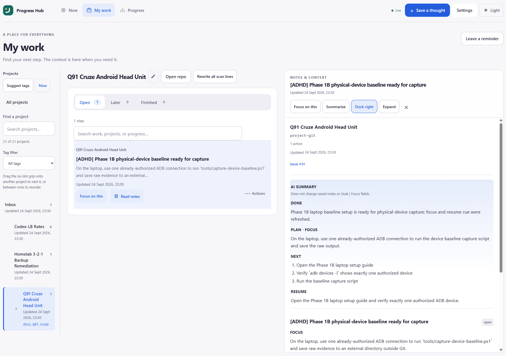

# A calmer dashboard



*Desktop My work with the Notes & context reader.* See the [README screenshots](../README.md#screenshots) for Now, Progress, and Settings (gallery shots use dummy data).

On desktop, use the compact **Appearance** button in the app header to cycle System → Light → Dark (the button shows the current mode). The same choices are available under **Settings → Preferences**; on mobile, use Settings. The preference is saved in this browser and follows operating-system changes when set to System. If browser storage is blocked, the dashboard still works and preferences last for the current page visit.

The home screen is **Now**: one chosen task, its next step, and one clear **Start** button. Your choice is remembered in this browser. **Start** (or **Pause here** while working) and **Done** stay visible; after **Done**, the success toast offers **Undo** to reopen the step quickly. If the undo request fails, the same toast returns with **Retry** (resends undo). If undo succeeds but a later reload fails, **Retry** only refreshes lists and focus — it does not resend undo. **More actions** holds **Choose another** and **Copy agent prompt**. With no task selected, choose one from your work or use **Help me choose** for a calm Next-up suggestion (quiet/stale open work with a resume cue ranks first; when Focus mode is on, the pick stays near your chosen project). **My work** is the browsing view for projects and threads; choosing **Focus on this** returns to Now. **Progress** contains activity and optional rewards, so the starting screen stays quiet. Finished threads remain available under **My work → Finished**.

On My work, each thread card shows a short **scan line** under the title when Focus, Resume, Goal, Next, or a safe progress snippet saved on that thread is available (heuristic by default; optional local LLM rewrite when AI scan-lines are enabled in **Settings → Preferences** or via `ADHD_HUB_AI_*` — see [environment variables](environment-variables.md)). The scan line spans the full card width and wraps up to two lines (ellipsis when longer). In AI settings, pick a Base URL preset (or custom URL — unknown saved URLs reopen as Custom… with the field filled); Save / Test & Load use the URL field as source of truth. **Test & Load Models** replaces the Model dropdown with that provider’s chat-capable models (Gemini OpenAI-compat ids drop a leading `models/` / `google/` prefix; embeddings, image/TTS variants, and Gemini flash ids deprecated for new users are hidden — prefer `gemini-3.6-flash`). Default AI timeout is 15s (raise up to 30s for local/proxy models). Stub or truncated AI replies fall back to the heuristic line with a calm toast. On Rewrite failure, the toast shows the outbound model id and a scrubbed provider snippet rather than always blaming a `models/` prefix; timeouts suggest raising Timeout in AI settings. Opt-in **Auto review scan lines** (default off) rewrites new/changed threads once per content hash and skips the provider when the hash matches; **Auto summarise notes** (default off) does the same for the Notes reader card on open. Full detail stays in Notes. Each row keeps **Focus on this** prominent; on desktop **Read notes** stays beside it, while on phones Notes moves into the row’s **Actions** menu to keep scanning compact. **Actions** also holds source links, refresh, **Rewrite scan line** (AI when enabled; heuristic fallback otherwise), and copy-link controls; with a project selected, the project header offers **Rewrite all scan lines** when **Enable AI** is on (confirm first; open threads only; one batch at a time per project — client and server reject a second run with a calm busy state / HTTP 409). When Enable AI is off, rewrite-all and per-thread **Rewrite scan line** are hidden so a no-op cannot look like a successful batch. The rewrite-all toast stays sticky for the batch request and does not show a fake `0/N` while waiting — completion reports `(completed/total)` only when at least one line updated. Tab focus / live refresh mid-batch keeps the button disabled as **Rewriting…** and re-shows the sticky progress toast instead of clearing the list. Source conflicts and refresh alerts remain visible without opening it. Only meaningful states, such as **In focus** or **Finished**, get a badge. **Read notes** opens the Notes & context reader for that thread’s saved continuity (Goal, Focus, Next, Blocked, Resume, notes, and forge activity). The reader toolbar offers **Focus on this** (same choose-thread behaviour as the card) beside **Summarise**, which can add a persisted AI card (Done / Plan·Focus / Next / Blocked / Resume) when AI scan-lines are enabled — it never rewrites the notes feed. See [Notes & context](notes.md).


Open Hub pages listen for authenticated live updates (SSE) and refresh relevant data shortly after Hub-side changes; if the live connection drops, ordinary Refresh / API use still works. Under **Settings → Forge**, **Sync health** shows last successful or failed forge reconciliation, concise errors, Needs review conflicts, recent change history from the activity ledger, and a Retry sync path beside Forge jobs.

Use **Save a thought** for a quick capture without leaving the current task. When you need to stop, choose **Pause here**, enter the smallest useful next step, and save it. That step appears when you return.

The **Where you left off** area renders saved Markdown (headings, lists, emphasis, and tables) for easier scanning. Raw HTML is escaped and remote images are shown as text descriptions.

Search narrows the loaded thread list in My work. On phones, small lists start with a compact Search control and expand the field only when requested; larger lists keep search visible. **Later** shows older open work without an overdue warning. When a step has been quiet long enough, Hub offers a soft **Still relevant?** check — confirm or ask again later. Nothing auto-dismisses. Status tabs show Open / Later / Finished counts as soon as My work loads (no need to click each tab first).

Select a project to show its title. On desktop, the pencil button beside the title opens project editing and **Open repo** appears when a repository URL is configured; **Rewrite all scan lines** stays in the project header. On phones, the current project name is the project switcher (ellipsis when long) and edit / repository / rewrite-all actions live behind its overflow menu so the **⋯** stays on-screen. Overflow menus (thread **Actions**, project header **⋯**, and the projects-rail **⋯**) flip open above the trigger when there is not enough space below — including above the mobile bottom nav — so the full panel stays reachable without scrolling the page. Projects can nest under other projects (Notion-style tree in the left rail; chevron expands, row click selects). Selecting a parent filters My work to that project plus all nested descendants; rail open counts aggregate the same way. **Rewrite all scan lines** on a parent rewrites open threads across that scope. Drag the six-dot grip to nest or reorder — on desktop the grip appears on row hover; on phones and touch devices it stays visible with a larger hit target and uses a pointer drag path (not HTML5-only). Inbox is not draggable. Tags stay orthogonal (comma-separated labels and rail filter). Use **Suggest tags** to review heuristic tag suggestions and apply only what you confirm. Each project shows its open-step count plus a calm last-touch cue instead of repeating the count. Add an HTTP(S) repository URL to expose the repository action; repository URLs containing credentials are rejected. Choose **Organisation / no repository** when creating a project to skip a repo URL and use the project as a hierarchy container only — forge sync no-ops for those.

## Optional small wins

In **Settings**, turn **Enable rewards** on or off and choose a daily goal of one, three, or five finished threads. Rewards start off by default. These preferences are saved per browser.

- Each currently finished thread contributes 10 XP. Every five finished threads adds a level.
- XP is calculated from actual hub records, including completions made by assistants; refreshing or repeating a completion does not add another thread's XP. Completion retries preserve the original date and do not append duplicate status notes.
- Daily counts and the activity chart use the hub's configured timezone. Taking a break does not reset your level.
- Completing a thread shows one short, quiet acknowledgment. There are no sound effects, confetti, or streak penalties, and reduced-motion preferences are respected.
- Rewards reflect the current data: reopening/deleting completed work or restoring a backup can change totals. They are not a separate permanent reward ledger.

The daily goal is an optional cue, not a deadline. It can be changed or switched off at any time.

## Browser verification

The smoke script uses a temporary hub, a temporary database, and sample projects. It does not change your running hub.

```bash
uv run --with playwright playwright install chromium
uv run --with playwright python scripts/browser_smoke.py
uv run --with playwright python scripts/ui_polish_smoke.py
# Optional: refresh README/docs product shots under docs/images/
ADHD_HUB_SCREENSHOT_DIR=docs/images uv run --with playwright python scripts/capture_readme_screenshots.py
```

The UI polish check exercises the four screens in both themes at desktop, tablet, and phone widths, checks navigation and keyboard disclosures, and captures screenshots. `capture_readme_screenshots.py` seeds a temporary hub with dummy projects and writes the light-theme desktop shots used in the README.

Set `ADHD_HUB_BROWSER_EXECUTABLE` to use an existing Chromium binary. Screenshots default to `/tmp/adhd-hub-preview`; override with `ADHD_HUB_SCREENSHOT_DIR`.

Switching projects clears the previous project’s actions while the new one loads. Late responses cannot overwrite a newer selection; failed loads show a retry message.

## Settings and sharing

Settings is a full application destination with categories for **Preferences**, **Account**, **Agents & install**, **Windows / MCP**, **OpenClaw**, **Forge**, and **Data**. Desktop uses the left category navigation; mobile opens a simple Settings index and each category has a Back to settings action. Appearance and rewards save automatically in this browser; timezone uses **Save**. Password controls are under Account. Forge setup (Default profile vs project repos, import policies, PATs) is documented in [Forge permissions](forge-permissions.md).

With rewards enabled, Progress shows the hub's current rank, upcoming rank, and six completion badges. Use **Share progress** to preview the exact export, then download a PNG or copy the text. Compatible devices also offer a share sheet. Nothing is posted automatically. The preview excludes task titles, project names, notes, and connection details. Ranks represent this hub's records; there is no public leaderboard yet.

See the [brand guide](brand-guide.md) for palette, assets, buttons, milestone thresholds, and tone of voice.

The Settings footer links to the public GitHub repository and shows the running server’s version from `/api/health`. Share text includes the public repository link, and PNG cards print its URL in the footer. Your private hub address is never used for that attribution.

Project tags and parent links are preserved when you rename a project slug. Archiving a parent clears children’s parent links so they become top-level again.
The organiser adds only the selected tags and preserves project settings (including parent). Projects archived after suggestions were loaded, or selections exceeding the eight-tag limit, are skipped so you can review them again.

### Workspace overview and controls

Now includes open-step, weekly completion, and project counts below the chosen step. Focus mode hides the overview to keep a single task in view. Counts use the same live overview as Progress.

My work has project search (name, slug, or tag) combined with the tag filter, plus a visible result count and empty state. The Projects rail shows a collapsible parent/child tree with **unlimited nesting** (expand state remembered in this browser). On desktop, drag a project onto another to nest it, or into the gap between rows to reorder siblings; `parent_slug` and `sort_order` persist. On small screens the rail opens as a full-screen left drawer (backdrop, Escape, focus trap). Drag the six-dot grip to nest or reorder — while dragging, the list auto-scrolls near the top/bottom edges so off-screen targets stay reachable. After a drop (or a cancelled drag), the drawer stays open so organising can continue: a move refreshes the tree via `loadAll` without closing the drawer, and only an intentional project pick (or All projects / close / backdrop) dismisses it. Ghost clicks and backdrop taps from the same pointer release are ignored briefly. **Suggest tags** stays in the drawer overflow so switching projects remains the primary browse action. Nested rows remain inside the viewport rather than requiring horizontal scrolling. Project rows show open-step counts and a last-touch cue; zero-open projects are visually quieter without being hidden. The edit form Parent select remains available as a touch-friendly fallback for hierarchy changes.

Thread **Actions** opens a compact panel without expanding the row. Only one panel stays open, Escape closes it and returns focus, and tabbing away closes it. When space below the trigger is short (especially above the mobile bottom nav), the panel opens upward so it stays fully reachable. **Focus on this** remains directly available; on phones **Read notes** moves into Actions to reduce repeated controls. Scan lines are clamped for compact phone scanning, while source conflicts stay visible. AI scan-line rewriting and source refresh remain in Actions.

Light uses porcelain surfaces and indigo controls; dark uses charcoal surfaces and periwinkle controls. Theme cycling and AI Test / Load Models settings remain available.

Appearance also offers named accent presets and a custom colour picker. The selection saves in this browser; Default restores the two built-in palettes. Custom shades adapt to maintain readable text and selected states in light and dark mode. Status and warning colours keep their semantic roles.
