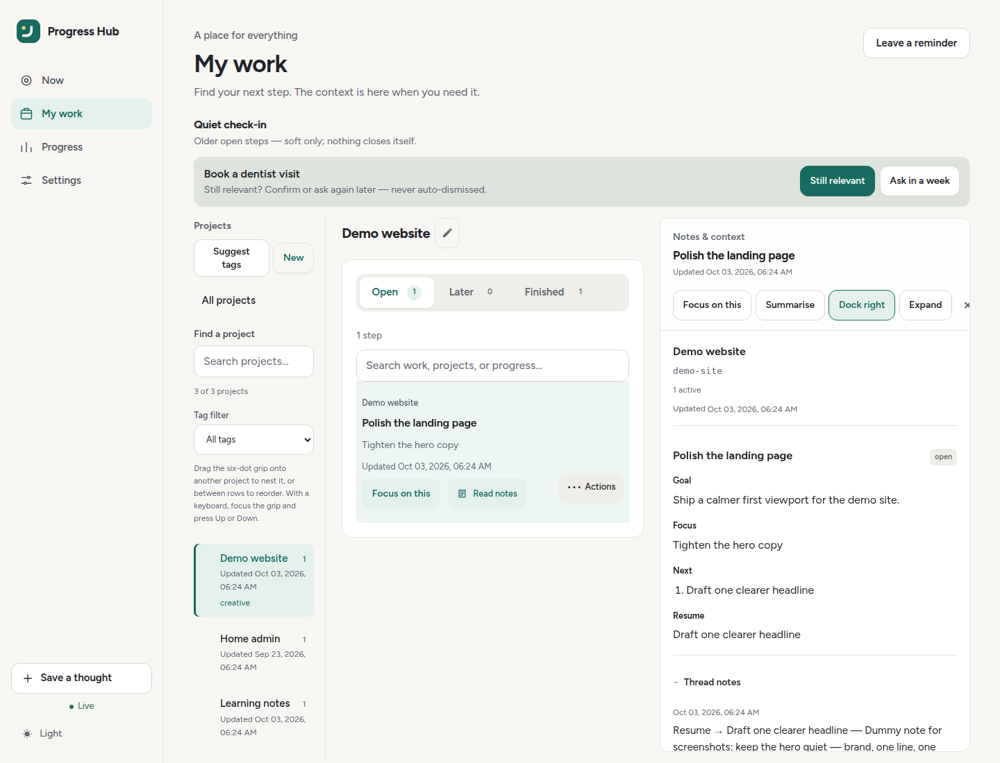

# Notes & context

**Notes & context** is the read-only continuity view for one thread.

## Open and close the reader

- Open it from **My work** by clicking a step row.
- On wide screens it sits beside the list; **Expand** makes it full width.
- On narrow screens it opens as a full sheet.
- Close it with × or Escape; keyboard focus returns to the row you opened.

The header shows the project, status, source, and thread title.

The footer contains:

- **Focus on this** or **Return to focus**;
- **Mark done**;
- a **⋯** menu for source-issue actions, **Copy link**, and optional AI actions.

!!! note "Editing continuity"
    The reader shows saved state; it does not edit Goal, Focus, Next, Blocked, or Resume. Use **Now → Pause and leave a note** or your agent's `upsert_progress` instead.

## Summarise (AI)

When a thread’s notes are open and AI is on, the reader’s **⋯** menu offers **Summarise notes with AI**. With AI enabled in **Settings → AI helpers** (same optional OpenAI-compatible endpoint as scan-lines), Hub asks the model for a short continuity-style card and places it near the top of the reader:

1. **Done**
2. **Plan · Focus**
3. **Next** — at most three steps
4. **Blocked** — only when something is waiting
5. **Resume** — optional one concrete action

How summarising behaves:

- the summary is saved on the thread with an input hash;
- reopening reuses the cached card while the source input is unchanged;
- **Summarise notes on their own** is off by default and only calls AI when the card is missing or stale;
- **Regenerate** always forces a new summary;
- source notes and structured Goal / Focus / Next fields are never rewritten;
- if AI is disabled or unconfigured, Hub points to AI settings instead of inventing a result.

## Where you left off

The continuity card at the top is always visible. It is built from the thread’s structured fields, in this order, and empty fields are left out:

1. **Where you left off** — the resume step, in a tinted panel
2. **Goal**
3. **Focus**
4. **Next steps** — at most three
5. **Blocked** — only when something is waiting

The title and status are in the reader header, so the card does not repeat them. If none of those fields are set, it says so and points you to **Pause and leave a note** on Now or an agent checkpoint. A persisted AI summary, when there is one, sits under this card.

The project overview strip (title, slug, active count, last update, forge link) is still part of the notes HTML and shows in Now’s project notes. The My work reader hides it because its header and menus already carry the same facts.

## Notes and history

**Notes and history** is the feed of notes saved on this thread. It opens when the feed is short or clearly written by a person, and stays closed when it is mostly ritual checkpoints. Open or close it without losing the feed.

Human notes are shown as Markdown and kept visually stronger. Ritual milestones — field-change lines and ceremony such as “Thread upserted from …” — are muted one-line summaries, with small chips for the fields that changed (Goal, Focus, Next, and so on). Consecutive checkpoints collapse into one closed line: **N checkpoints · last: …**. Expand that line to see each checkpoint.

The reader shows about the latest five feed items. Anything older stays under **Show older**.

## Other active threads

Other unfinished threads in the same project are listed under the notes, each closed by default. A summary shows the title, status, and **Choose this step**. Opening one shows a shorter continuity card. **Choose this step** closes the reader and returns to Now with that thread selected.

## Full PROGRESS.md

**Full PROGRESS.md** is closed by default. It is the project file the Hub rewrites (active threads, recent milestones, and older history), not a second copy of the continuity card. Open it when you need the whole project file.

## Forge activity

**Forge activity** is an accordion for the linked issue: comments, plus a short timeline. It opens when comments exist. Comments stay display-only. They are not copied into Goal, Focus, Next, Blocked, or Resume.

If the forge cannot be reached, the section says activity is unavailable. The Hub sections above remain the current continuity. With no linked issue, the section says so. With a link and no comments yet, it says there are no comments.

## Copy agent prompt

On Now, **Copy agent prompt** builds a short prompt from the chosen thread:

- Project slug and title, the thread title, and `thread_id`.
- The linked forge issue number and URL, when the thread has one.
- **Resume**, **Next**, **Goal**, **Focus**, and **Blocked**, when those fields are set.
- A **Progress** snippet only when it is a human note. Milestone, status-history audits (``[status→…]``), URL-only, and other boilerplate snippets are left out, so the prompt does not repeat checkpoint walls. When a newer audit sits on top of an older human note, Progress uses that eligible note.

Empty sections are omitted. **Next** is capped at three steps.

## What to write on a routine checkpoint

Update the structured fields (Goal, Focus, Next, Blocked, Resume) and leave freeform note text out. Reserve a freeform note for a real decision, blocker, or ship note — not a line such as “Thread upserted from …”. The reader is built for that habit: the continuity card stays in front, and ritual history stays muted.

The writing convention, including the 30-second minimum, is in [Writing & continuity](writing.md).
