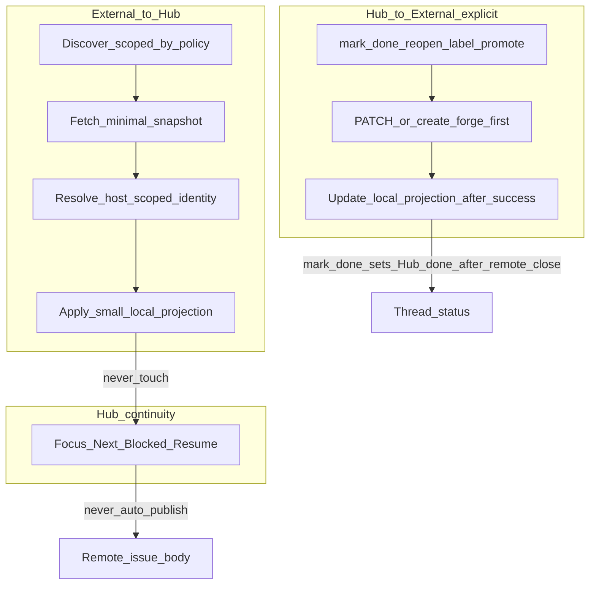

# Foundation B2 — repo-primary issue sync & reconciliation

Parent: [#71](https://github.com/uniskela/adhd-hub/issues/71) · Slice: [#74](https://github.com/uniskela/adhd-hub/issues/74) · Depends on: [#73](https://github.com/uniskela/adhd-hub/issues/73) / PR #76

## Goal

For **externally backed** work (`authority=external`): GitHub/Gitea owns the task; ADHD Hub owns continuity.

| Layer | Owns |
| --- | --- |
| Repo | identity, title, body (outside any optional Hub markers), open/closed, labels/assignees/milestone where supported |
| Hub | Focus, Next, Blocked/Waiting, Resume, local progress/history, sessions / future stats |

State split (from B1, enforced here):

- `Thread.status` — Hub continuity only (`open` / `blocked` / `done` / `dismissed`)
- `external_issue_state` — canonical remote task state (`open` / `closed`)

Local/non-repo work (`authority=hub`) stays Hub-owned and does **not** require a forge.

**Delivery:** #74 ships as two reviewable PRs (B2a then B2b). Issue #74 closes only when both are complete.

**Transitional slice:** B2a disables legacy Hub-status→remote-state (and default status-block) mirroring. B2b supplies the replacement explicit remote-first mutations (`mark_done` / reopen / promote). **Do not cut a user-facing release between B2a and B2b** unless the transitional gap is intentionally documented (after B2a alone, Hub `mark_done` / continuity upserts no longer close remotes, and explicit remote close is not yet available).

## Current Hub-primary assumptions (to replace)

Mapped on `main` @ `340a0fd` (post-#76):

1. `BoardForgeSync.sync_thread` / `_update_issue` set remote `state` from `Thread.status` (done/dismissed → closed).
2. `_create_issue` auto-creates forge mirrors for Hub threads after progress/upsert via `_forge_after_thread`.
3. `render_status_block()` / body merge **publishes** Goal/Focus/Next/Blocked/Resume into issue bodies.
4. `import_forge_inbox(..., close_imported=True)` + `mark_issue_imported` **closes** remotes and stamps `adhd-hub-synced`.
5. Inbox discovery requires hub label **or** `[ADHD]` title (not ordinary open issues).
6. Scheduler `forge_inbox` job only runs the mailbox importer.
7. B1 identity exists (`attach_external_identity`, host-scoped uniqueness) but revision metadata and ownership enforcement were deferred.

B1 identity/authority model is **fixed foundation**. Do not redesign it unless a concrete blocker appears.

## Approaches considered

1. **Evolve `BoardForgeSync` in place** — smaller diff, high risk of leaving Hub→state/status-block coupling.
2. **New `RepoWorkSync` (chosen)** — authority-aware discover/reconcile/mutate; `BoardForgeSync` shrinks to HTTP transport (+ optional legacy status-block helpers behind opt-in); `ForgeFacade` orchestrates.
3. **Full forge rewrite** — unnecessary scope.

## Architecture

### Modules (proposed)

| Unit | Responsibility |
| --- | --- |
| `work_identity` (B1) | source/authority/identity helpers — unchanged contract |
| `forge/repo_sync.py` (new) | discover, reconcile, fingerprint/no-op, promote/link |
| `forge/board_sync.py` | HTTP transport; status-block helpers **opt-in / legacy only** |
| `forge/facade.py` | config, Sync now, import policies, scheduler wiring |
| `store` / `service` | write-boundary enforcement; revision + import-policy + minimal Needs review |
| MCP / thin API | continuity upserts stay Hub-only; explicit forge-aware ops for repo fields |

## Continuity publication (status blocks)

`BoardForgeSync.render_status_block()` today embeds Goal/Focus/Next/Blocked/Resume and related Hub metadata. That is **Hub-owned / private continuity**.

| Mode | Remote behaviour |
| --- | --- |
| `authority=external` (default) | **No** continuity PATCH (no status block, no state/title/labels from Hub) |
| `authority=external` + `publish_hub_status_block=true` | **Body status-block merge only** — never mutate remote `state`, title, or labels from Hub |
| Legacy local mirror | Only for `authority=hub` **without** attached identity, and only when `board_mirror_local=true` — isolated path; may create/update Hub-owned mirror issues including status block |

### `board_mirror_local` vs B1 pin-on-link

Do **not** weaken B1: attaching external identity pins `work_source` and yields `authority=external`.

Prefer **preserving existing legacy mirrors only** rather than creating **new** Hub-primary mirrors that immediately become external-authority once identity is attached:

- `board_mirror_local=true` may continue updating **already-mapped** hub-authority threads that already have a forge issue number/meta **and** still resolve as `authority=hub` (no pinned external identity yet / local source).
- Default remains `board_mirror_local=false`: **do not create new** Hub-primary mirror issues on progress.
- Once identity is attached (B1 pin-on-link), the thread is external-authority; Hub-primary create/update (state/title/labels) stops. Optional status-block-only publish requires `publish_hub_status_block`.

## Small local projection

#74 does **not** turn Hub into a full issue cache.

**Project locally (required):**

- B1 identity: provider, host, owner, repo, number
- Display title → `summary` (from remote title)
- `external_issue_state` (`open` / `closed`)
- Labels needed for import filtering / light UI (normalized sorted list or equivalent)
- Revision: `external_updated_at` (provider timestamp), `external_fingerprint` (hash of normalized projected fields)

**Do not project unless a concrete #74 code path requires it:**

- Full issue body
- Comments / timelines
- Milestone objects
- Assignees beyond what `assigned_to_me` discovery needs transiently
- Reactions, projects-v2, etc.

Transient fetch fields used only during discover (e.g. assignee login for `assigned_to_me`) need not be persisted.

## Ownership enforcement at write boundaries

### Continuity / MCP / generic upserts (`authority=external`)

Must **not**:

- Locally mutate repo-owned projected fields (`summary`/title, `external_issue_state`, identity columns, projected labels)
- Implicitly PATCH remote open/closed (or title/body) from `Thread.status` or continuity edits
- Publish continuity into the remote issue body

**Refuse loudly:** if a continuity API (`upsert_progress`, generic `ThreadUpsert`, etc.) attempts a repo-owned field mutation on an external-authority thread, raise a clear domain/`ValueError` (API → 400 with that message). **Do not silently ignore** forbidden fields.

Allowed: Focus / Next / Blocked / Resume / Hub `Thread.status` (local only) / progress history — Hub-local only.

### Continuity vs explicit external completion

| Path | Remote open/closed | Local `external_issue_state` | Hub `Thread.status` |
| --- | --- | --- | --- |
| `upsert_progress` / normal continuity | Never | Never | Continuity fields only; never drives remote |
| B2a `mark_done` (transitional) | Never (mirroring removed) | Never | Sets Hub `done` only — **gap until B2b** |
| B2b `mark_done` on `authority=external` | Close remote **first** | Update after remote success | Set Hub `done` only after remote + projection succeed |
| `dismiss` | Never | Never | Hub `dismissed` only |

### Repo-owned changes (B2b)

Must use **explicit forge-aware operations**:

1. Mutate forge first
2. On success only: update local projection (+ fingerprint / `external_updated_at`)
3. On failure: leave local projection unchanged; return structured error (fail loud; no silent queue in #74)

Examples: mark_done (close remote), reopen, supported label change, promote/link/create.

### Dismiss

Hub-only. Does **not** close the remote issue and does **not** change `external_issue_state`.

### When `authority=hub` (local)

- No auto-create of forge issues on progress (`board_mirror_local=false` by default).
- Deliberate promote/link (B2b) switches authority to external.
- Status-block mirror only if `board_mirror_local` (legacy) is enabled.

## Valid split-state combinations

`Thread.status` and `external_issue_state` mean different things. These combinations are **valid**:

| Hub `Thread.status` | `external_issue_state` | Meaning |
| --- | --- | --- |
| `open` / `blocked` | `closed` | Remote task finished; Hub continuity still active / waiting to be closed out |
| `done` / `dismissed` | `open` | Hub finished or dismissed continuity; remote issue still open |
| `open` | `open` | Normal active external work |
| `done` | `closed` | Aligned after explicit mark-done (or operator aligned both) |

**Display only (not Needs review):** ordinary split states above, including after inbound reconcile that updates `external_issue_state` without changing Hub status.

**Needs review (ambiguous / unsafe to guess):**

- Identity collision: same external identity would attach to a second thread
- Promote/link target already linked to a different thread or unresolved multi-project claim
- Forge target incomplete / offline evidence insufficient to attach or heal
- Explicit outbound mutation partially unclear after provider errors that leave authority ambiguous (rare; prefer fail loud over inventing review noise)

Inbound reconcile that merely sets `external_issue_state=closed` while Hub stays `open` is **display**, not Needs review.

## Import / discovery policy

Per forge config (global + optional project override):

- `issue_import_policy`: `manual` | `all_open` | `labels` | `assigned_to_me` | `adhd_inbox` (compatibility)
- `issue_import_labels`: list[str] (when `labels`)

**Safe defaults:**

- New / unconfigured repo sync: **`manual`** — do **not** default to `all_open`
- Migrated installs that already used the Hub inbox (`[ADHD]` title and/or hub label): retain **`adhd_inbox`** (or equivalent labels+title filter) until the operator explicitly changes policy
- Discover/import **never closes** remotes by default (`board_inbox_close_imported=false`)
- Legacy close-on-import may remain as explicit opt-in only

`[ADHD]` is compatibility/optional — not required for `all_open` / `assigned_to_me` / `labels`.

## Project / repo scoping & identity uniqueness

**Discovery / new association** uses the project’s forge target (`forge_owner`/`forge_repo` override or global forge owner/repo). Never ambient “all issues on the forge account”.

**Linked reconciliation** uses the thread’s **pinned** B1 identity `(provider, host, owner, repo, number)`. It must **not** re-target whatever repo the project forge config currently points at. If credentials/config cannot safely access that pinned identity, return a structured skip/error (`pinned_identity_unreachable` or similar) — **never** substitute another repo.

External identity remains globally unique (B1 host-scoped unique index). **Never** create a second thread for the same identity.

**Atomic external import:** use a transactional `get_or_create_thread_for_external_identity` (or equivalent) so a thread is never left orphaned if identity attachment loses a race/collides. On collision, return the existing thread / structured skip — do not create-then-fail.

**Deterministic project association** when multiple Hub projects reference the same repository:

1. If an identity is already attached to a thread → that thread’s project wins; other projects must not re-import it.
2. Else if exactly one configured project claims that `(provider, host, owner, repo)` → attach new continuity there.
3. Else if multiple projects claim the same repo → **Needs review**; do not guess; do not duplicate.

**PR exclusion:** GitHub issue-list payloads that include a `pull_request` key must **not** become Hub tasks (issues only). Cover with tests. Gitea: exclude pull requests by the provider’s issue-vs-PR distinction when present.

### `assigned_to_me` username source

Canonical assignee filter username comes from, in order:

1. Explicit configured account on forge config (e.g. `forge_account_login` / `assigned_to_me_login`), or
2. Authenticated-user provider lookup (e.g. `GET /user`) with a short-lived cache.

**Do not** infer the username from `board_inbox_authors`. If neither configured login nor authenticated-user lookup is available, fail clearly (`assigned_to_me_login_unavailable`) rather than guessing.

## Fingerprint normalization

- `external_updated_at` := provider’s issue `updated_at` (normalized to a stable string/ISO form).
- `external_fingerprint` := cryptographic hash over a **canonical normalized tuple** of projected repo-owned fields, **not** raw provider JSON.

Canonical fields for the hash (v1):

- provider, host, owner, repo, number (normalized casing/host rules from B1)
- state (`open`/`closed`)
- title: strip; Unicode **NFC** normalization; then compare/hash
- labels: lowercased, sorted, unique

Do **not** include body/comments/milestone unless later added to the projection. Changing normalization requires a documented version bump or re-fingerprint on next reconcile (accept one-time apply).

No-op when fingerprint matches and no policy forces refresh.

Tests must include NFC equivalence (e.g. composed vs decomposed accented title → same fingerprint).

## External → Hub reconciliation

For each **already-linked** identity:

1. Fetch using the **pinned** identity (not current project forge repo).
2. If unreachable → structured skip/error; do not retarget.
3. Compute fingerprint from normalized projected fields; record provider `updated_at`.
4. If fingerprint == stored → **no-op**.
5. Else apply small local projection only (title/summary, state, labels-as-needed, revision fields).
6. **Never** overwrite Focus / Next / Blocked / Resume / progress history.
7. **Never** auto-set Hub `done`/`dismissed` from remote close (split state is valid / display).

For **discovery** of new issues: use project forge target + import policy; then atomic get-or-create by identity.

Heal B1 unresolved `forge_issue:` mappings only when forge target evidence is unambiguous; otherwise Needs review / leave unresolved.

## Hub → external explicit actions (B2b)

- mark_done / reopen / supported labels / promote-link: forge first, then local projection.
- mark_done success path: `external_issue_state=closed` then Hub `status=done`.
- reopen success path: `external_issue_state=open` then Hub `status=open` (if that is the explicit action’s Hub effect).
- Rate-limit / 5xx: backoff on scheduled job; surface last error for Sync now.
- No durable silent retry queue in #74.

## Periodic reconcile + Sync now

**Manual Sync now (B2a) / scheduled job (B2b) share this inbound shape:**

1. Wiki/scaffold unchanged (where enabled).
2. Enumerate already-linked external threads; reconcile each from **pinned identity** — not gated on the project’s currently resolvable forge target.
3. Credentials apply only when safe for that pinned provider/host; otherwise `pinned_identity_unreachable` — never substitute the project’s current repo.
4. Separately, for projects with a resolvable forge target, run **new issue discovery** per import policy.
5. Do not create new Hub mirrors; `board_mirror_local` is preserve-existing-only.

B2b adds: overlap lock, backoff cron (`forge_repo_reconcile`). Webhooks not required for correctness.

## Local → repo promotion (B2b)

1. Create new issue **or** link existing `owner/repo#N` on the project’s forge target.
2. `attach_external_identity` + pin `work_source`; refuse if identity already elsewhere → Needs review.
3. Keep Hub continuity local; no private history dump; no status block unless opt-in.
4. Authority becomes external thereafter.

## Needs review (minimal for #74)

Persist only enough for operators/agents to act:

- kind / reason code
- project_slug (if known)
- external identity fields when relevant
- thread_id(s) involved
- created_at / short message
- dismiss/ack hook (reuse `pending_actions` if it fits without expanding into #75)

No event ledger, SSE, or sync-health UI in #74.

## Schema additions (#74)

Additive on `threads`:

- `external_updated_at` TEXT NULL
- `external_fingerprint` TEXT NULL
- projected labels storage only if required for filtering/UI (keep minimal)

On forge config / projects:

- `issue_import_policy` default **`manual`** (migrated inbox → `adhd_inbox`)
- `issue_import_labels`
- `forge_account_login` (explicit `assigned_to_me` username; else authenticated `/user`)
- `board_mirror_local` bool default false (preserve existing mirrors only; no new Hub-primary creates)
- `board_inbox_close_imported` bool default false
- `publish_hub_status_block` bool default false (external: body status-block only when true)

## PR split under #74

### B2a — inbound authority & stop Hub-primary mirroring

- Write-boundary enforcement on continuity upserts with **clear errors** (no silent ignore)
- Stop Hub-status → remote open/closed on sync/create; stop default status-block publication for `authority=external`
- Stop close-on-import by default; safe import policy defaults (`manual` / migrated `adhd_inbox`)
- Project/repo-scoped discover + small projection + fingerprint/no-op reconcile apply path
- Deterministic multi-project association; no duplicate identities
- Document transitional gap: Hub `mark_done` no longer closes remotes until B2b
- Tests for the above (GH+Gitea adapters as needed)
- **Not a release cut** between B2a and B2b unless transitional behaviour is intentionally published

### B2b — explicit outbound + promote + scheduler + Needs review

- Remote-first `mark_done` / reopen on external-authority threads (close remote → `external_issue_state` → Hub `done`)
- Promote / link APIs (no private history; no status block by default)
- Periodic reconcile job + lock/backoff + Sync now wiring
- Minimal Needs review persistence + heal-unresolved where safe
- Tests for outbound failure leaving projection unchanged, promote collisions, scheduler overlap

**#74 closes only when both B2a and B2b are merged.**

## Compatibility

- Preserve thread IDs and B1 identity columns.
- Dual-write `forge_issue:` meta continues during transition.
- MCP `thread_id` semantics unchanged; add explicit forge-aware tools/params only as needed.
- Existing local-only installs with forge disabled: no behaviour change.
- Legacy mirror + status-block paths remain behind opt-in flags only.

## Non-goals

- #75 event ledger / SSE / sync-health UI (Sync now may expose a last_error string only).
- #72 statistics.
- Full issue body/comment cache or collaborative editor.
- AI conflict arbitration / last-write-wins.
- Required webhooks.
- Unrelated UI redesign.

## Testing plan

**B2a:** projection/fingerprint no-op; continuity upsert cannot change repo fields; no remote state from Hub status; no status block on external by default; import defaults; scoped discover; multi-project association; no close-on-import.

**B2b:** remote-first close/reopen; failed PATCH unchanged local; promote/link; no private leak; Needs review on collision; scheduler lock/backoff.

Plus focused suites and full `pytest` / `ruff` vs main baseline.

## Spec self-review

- B1 preserved; status blocks default-off for external authority.
- Projection kept intentionally small.
- Write boundaries explicit; split states documented (display vs Needs review).
- Import defaults safe (`manual`); migrated inbox retains compatibility scope.
- Discovery project/repo scoped; identity never duplicated.
- Fingerprint over normalized fields; provider `updated_at` separate.
- Needs review minimal; #75 deferred.
- Two PRs (B2a/B2b); #74 closes after both.

## Review gate

Do **not** implement until this revised design is confirmed. Next: write implementation plan(s) for B2a then B2b under `docs/superpowers/plans/`, then tests-first coding on `feat/foundation-b2-repo-primary-sync` (or per-slice branches as preferred).
